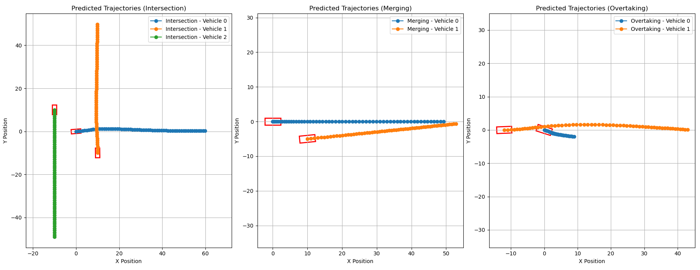

# DeepGame-TP: Dynamic Game-Theoretic Trajectory Planner
This repository contains a trajectory planner based on a game-theoretic approach. Traffic is modeled as a non-cooperative dynamic game, in which agents choose their optimal strategies while considering that other agents are also optimizing their own strategies. The trajectory planner solves the dynamic game by computing the **Generalized Nash Equilibrium (GNE)**, a state where no agent can improve its outcome unilaterally, given the strategic choices and constraints of all other agents. For further information please check the related paper: 


Giovanni Lucente, Mikkel Skov Maarssoe, Sanath Himasekhar Konthala, Anas Abulehia, Reza Dariani, Julian Schindler, **DeepGame-TP: Integrating Dynamic Game Theory and Deep Learning for Trajectory Planning**, *IEEE Open Journal of Intelligent Transportation Systems* (Volume: 5), 2024. DOI: [10.1109/OJITS.2024.3515270](https://doi.org/10.1109/OJITS.2024.3515270)


This repository contains the implementation of **DeepGame-TP** without the LSTM network presented in the paper. The application simply solves the dynamic game without using deep learning to predict the cost function. 
For further information and videos of **DeepGame-TP** implemented in [**ADORe**](https://github.com/DLR-TS/adore), please visit this [page](https://giovannilucente.github.io/dynamic_game_trajectory_planner/).

## Installation and Setup:
To install and run this project locally, follow these steps:

### 1. Clone the Repository
First, clone the repository to your local machine:
```bash
git clone https://github.com/giovannilucente/dynamic_game_trajectory_planner.git
cd dynamic_game_trajectory_planner
```

### 2. Install Python Dependencies
Install all the required dependencies listed in the requirements.txt, for the python file used for plotting:

**Note**: the suitable python version is *python==3.10.12*

```bash
pip install -r requirements.txt
```

### 3. Install C++ Dependencies

**Linux(Ubuntu/Debian)**
```bash
sudo apt update
sudo apt install libeigen3-dev cmake g++
```

**Mac (Homebrew)**
```bash
brew install eigen cmake
```

**Windows (vcpkg)**
```bash
vcpkg install eigen3
```

### 4. Build and Run the Project (CMake)
**Linux / macOS**
```bash
mkdir -p build
bash build_and_run.sh
```
**Windows**
```bash
mkdir build
cd build
cmake ..
make
./dynamic_game_trajectory_planner
cd ..
python3 plot_trajectories.py
```
If everything works, you should see the plot of the computed trajectories in three different scenarios:

Some information, including the trajectory points for each vehicle, are printed in the terminal.
To create a new scenario to test, please refer to the main.cpp file, where the three scenarios above mentioned are created.
